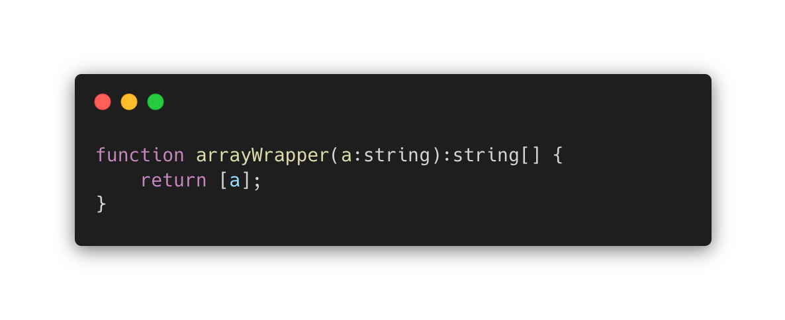
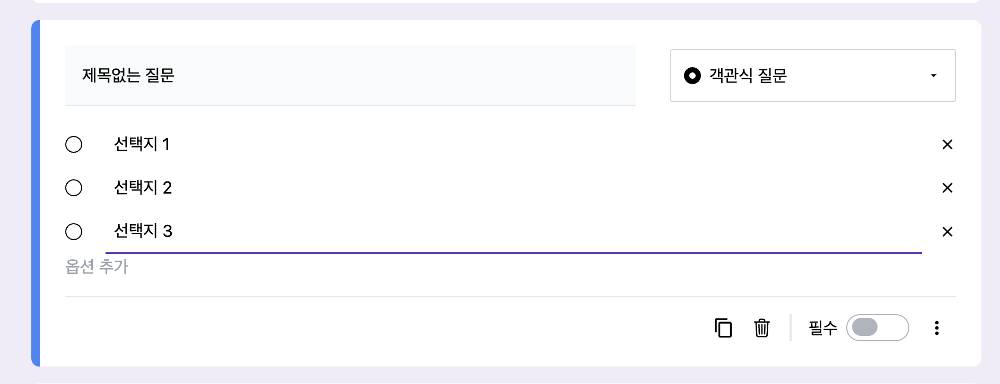
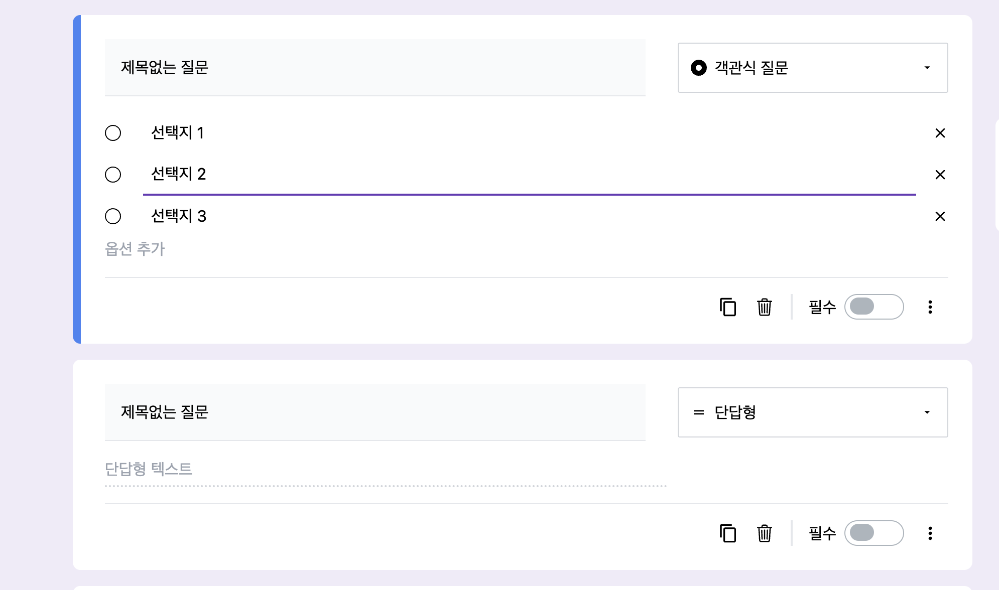

## 개요

프로젝트를 진행하면서 custom Hook을 사용해야할 일이 있었다.

다양한 곳에서 custom hook을 활용하기 위해선 generic 활용이 필수라는 것을 느꼈고, 학습 후 코드에 적용해보게 되었다.

generic은 Java나 C++ 등의 정적타입 언어에서 동적타입 기능을 제공해주는 역할을 하고있기 때문에 정적타입 언어에서 중요한 문법이라고 볼 수 있다.

Javascipt는 동적 타입 언어이지만, Typescript를 통해 정적타입 언어로 코드를 관리하기 때문에, 동적타입 기능을 제공해주는 generic에 대한 이해가 필요하다.

이에 따라 generic에 대해 학습해보고 이전에 진행했던 프로젝트에 적용해봄으로써 실전활용도 해보고자 한다.

## 제너릭(generic)이란?

generic은 컴포넌트에 대해 재사용성을 높혀줄 때 활용하는 문법이다.

즉, 어떤 컴포넌트에 대해 다양한 타입 활용이 가능하도록 만들어준다.

### 일반 함수와의 차이

다음은 어떤 string 값을 넣었을 때 배열로 감싸 반환하는 함수이다.

typescript를 사용할 때에는 파라미터에 값을 명시해주어야 하므로, 다음과 같이 string타입을 명시해주어 구현이 가능하다.

그렇다면, 여기서 number값을 활용해야되는 경우가 생긴다면, 다음과 같이 만들어볼 수 있다.

.png>)

코드만 봐도 부자연스러움이 느껴진다. 하는 기능은 똑같은데 타입때문에 똑같은함수를 두번 정의해야하기 때문이다.

이 코드는 any타입을 활용하여 중복된 코드를 줄일 수 있다.

.png>)

하지만, any타입을 사용할 경우, 지금은 괜찮지만, 복잡한 함수의 경우 런타임 환경에서 코드의 오류를 파악하기 힘들어 질것이다.

이러한 any의 단점을 해결할 수 있는 방법이 generic이다.

.png>)

generic을 활용하여 함수의 선언부에서 타입을 동적으로 선언할 수 있게 된다.

따라서, 일반함수와 비교하여 generic을 사용함으로써 중복된 코드를 방지할 수 있으며 any타입 의 사용을 줄일 수 있게 된다.

## 활용 예시

### 프로젝트 문제상황

구글 폼 클론 프로젝트에서 generic을 활용하여 중복코드를 줄여본 경험을 공유하고자 한다.

구글 폼 클론 프로젝트에서는 질문의 선택지를 리스트에 저장하여 리스트 내 선택지가 추가 및 삭제가 될 때마다 렌더링을 시켜주어야 하는 구조이다.

이를 구현하기 위해 선택지 리스트 state를 생성해주는 custom hook을 만들어주었다.

.png>)

하지만, 이 리스트에 들어갈 수 있는 타입은 선택지(Option)에 맞춰져있기 때문에 다른 상황에선 사용할 수가 없는 구조이다.

여기에 선택지 리스트 뿐만아니라 질문 리스트를 생성해야 하는 상황이 발생하였다.

이에 대한 리스트를 생성하기 위해 useQuestionList라는 이름의 새로운 훅을 만들어도 되지만, useOptionList와 기능이 같고, 중복된 코드가 발생하게 된다.

그래서, generic을 활용하여 두 군데 혹은 그 이상의 군데에서 사용이 가능한 custom hook을 만들어보고자 한다.

## Generic을 활용한 Custom hook 만들기

다시 useOptionList hook을 살펴보자

.png>)

먼저

- 함수를 선언할 때 제너릭을 선언해준 후
- Option관련 Type이 쓰인 부분을 generic으로 바꿔주자.

## JSX에서 제너릭 함수 선언하기

JSX에서 제너릭 함수를 선언하고자 하면 다음과 같은 에러가 뜬다.

제너릭 선언 구조가 xml 선언구조와 같아 파싱하는 과정에서 문제가 생기는 듯 하다.

[이 글](https://stackoverflow.com/questions/32696475/typescript-tsx-and-generic-parameters)을 참고하여 해결하였다.

,(쉼표) 만 붙혀주면 해결된다.

## 함수 내 타입 generic으로 변경하기

Option관련 타입을 generic으로 변경해주어 질문 리스트도 생성 가능하도록 바꿔주었다.

이제 useList를 선언하는 환경에서 타입을 지정해주면 여러 용도로 사용이 가능해졌다.

## 느낀점

제너릭 학습 이전에는 Typescript의 주요 기능으로 제너릭이 있다는 사실만 알았고, 왜 쓰는지 왜 중요한 지에 대해서는 몰랐었다.

이번 글을 통해 제너릭을 대체코드와 비교해봄으로써 제너릭이 탄생한 배경에 대해 이해할 수 있었고, 직접 코드에 적용해보면서 중요성을 체감할 수 있었다.

제너릭은 범용적으로 자주쓰이는 함수와 시너지가 나기 때문에 React의 component 내에서는 활용하기가 제한적이고, custom hook이나 라이브러리를 만들 때 사용하는 것이 더 유용해보인다.
